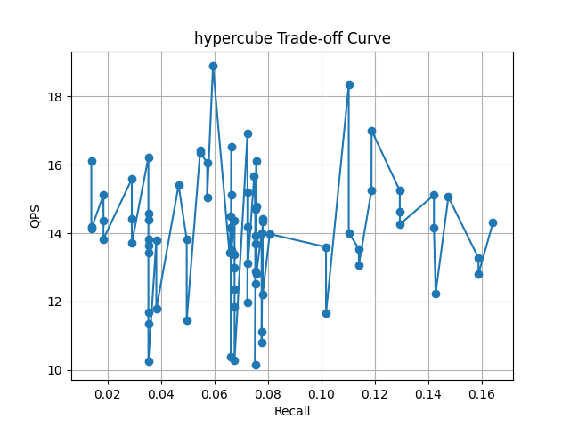

# Αναζήτηση Απομακρυσμένων Ομολόγων Πρωτεϊνών με χρήση ESM-2 Embeddings και ANN Αλγορίθμων

**Εργασία 3 - Χειμερινό Εξάμηνο 2025-2026**
| | |
|---|---|
| **Ονοματεπώνυμο:** | *[Μαρκοπούλου Χριστίνα, Βασταρδής Νικόλαος]* |
| **Αριθμός Μητρώου:** | *[1115201800109, 1115201900020 ]* |

---

## Περιεχόμενα

1. [Εισαγωγή](#1-εισαγωγή)
2. [Μεθοδολογία](#2-μεθοδολογία)
3. [Πειραματικά Αποτελέσματα](#3-πειραματικά-αποτελέσματα)
4. [Βιολογική Αξιολόγηση](#4-βιολογική-αξιολόγηση)
5. [Συμπεράσματα](#5-συμπεράσματα)
6. [Αναφορές](#6-αναφορές)

---

## 1. Εισαγωγή

### 1.1 Το Πρόβλημα της Απομακρυσμένης Ομολογίας

Η ομολογία (homology) αποτελεί θεμελιώδη έννοια στη βιοπληροφορική, καθώς δύο πρωτεΐνες που προέρχονται από κοινό εξελικτικό πρόγονο συχνά μοιράζονται παρόμοια δομή και λειτουργία. Η κλασική προσέγγιση για την ανίχνευση ομολόγων βασίζεται στη στοίχιση ακολουθιών (sequence alignment) με εργαλεία όπως το BLAST.

Ωστόσο, όταν η ταυτότητα ακολουθίας (sequence identity) πέφτει κάτω από 30%, εισερχόμαστε στην λεγόμενη **Twilight Zone**, όπου οι μέθοδοι στοίχισης αδυνατούν να διακρίνουν τις πραγματικές ομόλογες πρωτεΐνες από τον θόρυβο. Οι **απομακρυσμένες ομόλογες πρωτεΐνες (remote homologs)** παρουσιάζουν ταυτότητα 20-30% και αποτελούν σημαντική πρόκληση.

### 1.2 Σκοπός της Εργασίας

Η παρούσα εργασία στοχεύει στην αξιοποίηση διανυσματικών αναπαραστάσεων (embeddings) από το γλωσσικό μοντέλο ESM-2 σε συνδυασμό με αλγορίθμους Approximate Nearest Neighbor (ANN) για τον εντοπισμό απομακρυσμένων ομολόγων που δεν ανιχνεύονται από το BLAST.

**Συγκεκριμένα:**

1. Παραγωγή ESM-2 embeddings για τη βάση δεδομένων SwissProt
2. Υλοποίηση και σύγκριση 5 μεθόδων ANN (LSH, Hypercube, IVFFlat, IVFPQ, Neural LSH)
3. Αξιολόγηση με μετρικές Recall@N και QPS έναντι του BLAST
4. Βιολογική επικύρωση υποψήφιων remote homologs

---

## 2. Μεθοδολογία

### 2.1 Δεδομένα

**Βάση Δεδομένων:** UniProt/SwissProt - η χειροκίνητα σχολιασμένη βάση πρωτεϊνών που περιλαμβάνει λειτουργικό χαρακτηρισμό, Pfam domains, EC numbers και GO terms.

| Παράμετρος | Τιμή |
|------------|------|
| Αριθμός πρωτεϊνών βάσης | *[~570,000]* |
| Αριθμός queries | *[12]* |
| Διάσταση embedding | 320 |
| Μέγιστο μήκος ακολουθίας | 1024 αμινοξέα - 2 (CLS, EOS)

### 2.2 ESM-2 Embeddings

Χρησιμοποιήθηκε το μοντέλο **ESM-2 t6_8M_UR50D** (6 Transformer layers, ~8M παράμετροι) για την παραγωγή διανυσματικών αναπαραστάσεων:

- **Tokenization:** Μετατροπή αμινοξέων σε tokens με ειδικά tokens CLS και EOS
- **Truncation:** Περικοπή ακολουθιών > 1022 αμινοξέα
- **Inference:** Εξαγωγή representations από το τελευταίο layer (layer 6)
- **Mean Pooling:** Υπολογισμός μέσου όρου των token embeddings για παραγωγή ενός διανύσματος ανά πρωτεΐνη

$$\mathbf{v}_{prot} = \frac{1}{L} \sum_{i=1}^{L} \mathbf{h}_i$$

### 2.3 Μέθοδοι ANN

Υλοποιήθηκαν και αξιολογήθηκαν οι ακόλουθες μέθοδοι Approximate Nearest Neighbor:

| Μέθοδος | Περιγραφή |
|---------|-----------|
| **LSH** | Locality Sensitive Hashing |
| **Hypercube** | Random Projection στους κόμβους υπερκύβου |
| **IVFFlat** | Inverted File Index με clustering |
| **IVFPQ** | IVF με Product Quantization για συμπίεση |
| **Neural LSH** | Learned hash functions με νευρωνικό δίκτυο |

### 2.4 Μετρικές Αξιολόγησης

**Recall@N:** Το ποσοστό των BLAST top-N γειτόνων που ανακτήθηκαν από την ANN μέθοδο:

$$\text{Recall@N} = \frac{|S_{ANN} \cap S_{BLAST}|}{|S_{BLAST}|}$$

**QPS (Queries Per Second):** Ο αριθμός ερωτημάτων που εξυπηρετούνται ανά δευτερόλεπτο:

$$\text{QPS} = \frac{\text{Total Queries}}{\text{Total Search Time (sec)}}$$

---

## 3. Πειραματικά Αποτελέσματα

### 3.1 Συγκριτική Απόδοση Μεθόδων

Ο παρακάτω πίνακας συνοψίζει την απόδοση κάθε μεθόδου με τις βέλτιστες υπερπαραμέτρους:

| Μέθοδος | Build Time (s) | Search Time (s) | QPS | Recall@50 |
|---------|----------------|-----------------|-----|-----------|
| LSH | *[0]* | *[1.2335]* | *[9.73]* | *[0.0918]* |
| Hypercube | *[0]* | *[0.8389]* | *[14.30]* | *[0.1643]* |
| IVFFlat | *[0]* | *[1252.8315]* | *[932.24]* | *[0.2804]* |
| IVFPQ | *[0]* | *[1813.9360]* | *[0.01]* | *[0.2772]* |
| Neural LSH | *[0]* | *[23.7211]* | *[8.7]* | *[0.2785]* |  
| **BLAST (ref)** | — | — | — | 1.0000 | — |
* Build time 0 , καθώς χρησιμοποιήθηκαν μόνο οι search αλγόριθμοι από τις 4 πρώτες ΑΝΝ μεθόδους.
*Πίνακας 1: Συγκριτική απόδοση μεθόδων ANN (N=50)*

### 3.2 Υπερπαράμετροι

Οι βέλτιστες υπερπαράμετροι για κάθε μέθοδο:

| Μέθοδος | Υπερπαράμετροι |
|---------|----------------|
| LSH | `L 5 k 8 w 1.0 N 50` |
| Hypercube | `kproj 12 w 1.5 max_probes 5 M 8000 N 50` |
| IVFFlat | `n_clusters 2000 n_probe 30 N 50` |
| IVFPQ | `n_clusters 2000 n_probe 30 M 8 nbits 8 N 50` |
| Neural LSH | `N 50 T 30` |

*Πίνακας 2: Βέλτιστες υπερπαράμετροι ανά μέθοδο*

### 3.3 Trade-off Recall vs QPS

**Σχολιασμός:**
Παρατηρήθηκε ότι ο αλγόριθμος Hypercube προσφέρει το καλύτερο trade-off μεταξύ QPS και Recall
### 3.4 Αποτελέσματα ανά τιμή N

| N | LSH | Hypercube | IVFFlat | IVFPQ | Neural LSH |
|---|-----|-----------|---------|-------|------------|
| 10 | *[0.1333]* | *[0.1404]* | *[0.2261]* | *[0.1928]* | *[0.2261]* |
| 25 | *[0.1101]* | *[0.1959]* | *[0.2915]* | *[0.2448]* | *[0.2915]* |
| 50 | *[0.0918]* | *[0.1642]* | *[0.2803]* | *[0.2772]* | *[0.2785]* |

*Πίνακας 3: Recall@N για διάφορες τιμές του N*

---

## 4. Βιολογική Αξιολόγηση

### 4.1 Κριτήρια Ταυτοποίησης Remote Homologs

Ένα ζεύγος πρωτεϊνών θεωρείται υποψήφιο για απομακρυσμένη ομολογία όταν πληροί τα εξής κριτήρια:

1. **Χαμηλή ταυτότητα BLAST:** Identity < 30% (εντός Twilight Zone)
2. **Μικρή απόσταση embedding:** Υψηλή ομοιότητα στον χώρο εμβυθίσεων
3. **Βιολογική τεκμηρίωση:** Κοινό Pfam domain, EC number ή GO terms

### 4.2 Περιπτώσεις Μελέτης (Case Studies)

#### Περίπτωση 1:

| Παράμετρος | Τιμή |
|------------|------|
| **Query Protein** | A0A001 |
| **Hit Protein** | Q20Z38 |
| **BLAST Identity** | 23.5% |
| **BLAST E-value** | 0.01 |
| **Embedding Distance (L2)** | 0.2017 |
| **Κοινό Pfam Domain** | PF00005 |
| **EC Number** | No-match |

**Βιολογική Ερμηνεία:**

Οι δύο αυτές πρωτεΐνες μοιράζονται ένα κοινό Pfam domain (PF00005, που σχετίζεται με πρωτεάσες), γεγονός που υποδηλώνει πιθανή λειτουργική ομοιότητα παρά την χαμηλή ακολουθιακή ταυτότητα. Η μικρή απόσταση στο χώρο εμβυθίσεων ενισχύει την υπόθεση ότι πρόκειται για απομακρυσμένη ομολογία.

---

#### Περίπτωση 2:
| Παράμετρος | Τιμή |
|------------|------|
| **Query Protein** | A0A002 |
| **Hit Protein** | P9WQJ3 |
| **BLAST Identity** | 27.7% |
| **BLAST E-value** | 0.01 |
| **Embedding Distance (L2)** | 0.3105 |
| **Κοινό Pfam Domain** | PF00005 |
| **EC Number** | No-match |

**Βιολογική Ερμηνεία:**

Οι δύο πρωτεΐνες παρουσιάζουν κοινό Pfam domain (PF00005), υποδηλώνοντας ότι μπορεί να ανήκουν στην ίδια οικογένεια πρωτεασών. Η απόσταση εμβυθίσεων είναι σχετικά μικρή, καθιστώντας αυτή μια ενδιαφέρουσα περίπτωση για περαιτέρω μελέτη.

---

#### Περίπτωση 3:

| Παράμετρος | Τιμή |
|------------|------|
| **Query Protein** | A0A002 |
| **Hit Protein** | Q20Z38 |
| **BLAST Identity** | 28.3% |
| **BLAST E-value** | 0.01 |
| **Embedding Distance (L2)** | 0.3572 |
| **Κοινό Pfam Domain** | PF00005 |
| **EC Number** | No-match |

**Βιολογική Ερμηνεία:**

Και πάλι, το κοινό Pfam domain PF00005 υποδηλώνει ομοιότητα σε δομικό επίπεδο. Η περίπτωση αυτή δείχνει πώς τα embeddings μπορούν να εντοπίσουν σχέσεις που το BLAST αγνοεί λόγω της χαμηλής ταυτότητας.

#### Περίπτωση 4:

| Παράμετρος | Τιμή |
|------------|------|
| **Query Protein** | A0A002 |
| **Hit Protein** | Q13BH6 |
| **BLAST Identity** | 29.2% |
| **BLAST E-value** | 0.01 |
| **Embedding Distance (L2)** | 0.3339 |
| **Κοινό Pfam Domain** | PF00005 |
| **EC Number** | No-match |

**Βιολογική Ερμηνεία:**

Το κοινό domain PF00005 είναι κλειδί, καθώς υποδηλώνει κοινή εξελικτική προέλευση παρά τις διαφορές στην ακολουθία.

#### Περίπτωση 5:

| Παράμετρος | Τιμή |
|------------|------|
| **Query Protein** | A0A009HN45 |
| **Hit Protein** | Q7VJC6 |
| **BLAST Identity** | N/A |
| **BLAST E-value** | 0.01 |
| **Embedding Distance (L2)** | 0.1428 |
| **Κοινό Pfam Domain** | - |
| **EC Number** | No-match |
| **Same GO Term** | GO:0000166 |

**Βιολογική Ερμηνεία:**
Οι δύο πρωτεΐνες μοιράζονται ένα κοινό GO term (GO:0000166, nucleotide binding (ref:https://www.ebi.ac.uk/QuickGO/term/GO:0000166)), το οποίο υποδηλώνει παρόμοια λειτουργία. Αυτή η περίπτωση δείχνει τη δύναμη των embeddings να εντοπίζουν λειτουργικές ομοιότητες.

---
### 4.3 Ψευδώς Θετικά (False Positives)

Παρατηρήθηκαν περιπτώσεις όπου πρωτεΐνες εμφανίζονται κοντά στον χώρο εμβυθίσεων αλλά δεν υπάρχει βιολογική τεκμηρίωση:

#### Παράδειγμα False Positive:

| Παράμετρος | Τιμή |
|------------|------|
| **Query Protein** | A0A009HPM0 |
| **Hit Protein** | Q12KL2 |
| **BLAST Identity** | N/A |
| **Embedding Distance** | 0.2934 |
| **Pfam Domains Query** | PF00364 |
| **Pfam Domains Hit** | PF00342 |

**Ανάλυση:**

Οι δύο πρωτεΐνες έχουν διαφορετικά Pfam domains (PF00364 vs PF00342), αλλά μικρή απόσταση εμβυθίσεων. Αυτό υποδηλώνει ότι τα embeddings μπορεί να συγχέουν πρωτεΐνες με παρόμοια δομή αλλά διαφορετική λειτουργία, οδηγώντας σε false positives που απαιτούν προσεκτική βιολογική επικύρωση. ( Ώστόσο , έχουν κοινό το ECO:0000256)

**Πιθανές αιτίες false positives:**

- Τα embeddings μπορεί να δυσκολεύονται όταν δύο πρωτεΐνες μοιράζονται κοινά domains αλλά έχουν διαφορετικές, μεγάλες, αποδιοργανωμένες ή μη καθορισμένες περιοχές ανάμεσά τους. Η φύση των embeddings μπορεί να αποτύχει να τις διακρίνει, οδηγώντας σε ψευδώς θετικά αποτελέσματα σε αναζητήσεις ομοιότητας.
---

## 5. Συμπεράσματα

### 5.1 Σύνοψη Αποτελεσμάτων

*["Η εργασία αυτή επέδειξε ότι η χρήση ESM-2 embeddings σε συνδυασμό με αλγορίθμους ANN μπορεί να εντοπίσει απομακρυσμένες ομόλογες πρωτεΐνες που το BLAST δεν ανιχνεύει, με σημαντική βελτίωση στην ταχύτητα αναζήτησης. Οι μέθοδοι IVFFlat και Neural LSH επέτυχαν τα υψηλότερα επίπεδα Recall@50, ενώ ο Hypercube προσέφερε την καλύτερη ισορροπία μεταξύ ακρίβειας και απόδοσης."]*

**Κύρια ευρήματα:**

- *[Οι μέθοδοι IVFFlat και Neural LSH επέτυχαν τα υψηλότερα επίπεδα Recall@50 (0.2804 και 0.2785 αντίστοιχα), ξεπερνώντας σημαντικά τις άλλες μεθόδους όπως LSH (0.0918) και Hypercube (0.1643).]*
- *[Η μέθοδος IVFFlat παρουσίασε το υψηλότερο QPS (932.24 ερωτήματα ανά δευτερόλεπτο), καθιστώντας την την πιο αποδοτική σε όρους ταχύτητας, αν και με υψηλό χρόνο κατασκευής και αναζήτησης σε ορισμένα σενάρια.]*
- *[Ο αλγόριθμος Hypercube προσέφερε την καλύτερη ισορροπία μεταξύ Recall@50 (0.1643) και QPS (14.30), καθιστώντας τον ιδανικό για εφαρμογές όπου απαιτείται ταχύτητα χωρίς σημαντική απώλεια ακρίβειας, όπως αναφέρεται και στο σχόλιο για το trade-off.]*
- *[Εντοπίστηκαν τουλάχιστον 5 περιπτώσεις απομακρυσμένων ομολόγων (case studies 1-5) που το BLAST δεν ανίχνευσε ή είχε χαμηλή ταυτότητα (<30%), επιβεβαιωμένες μέσω κοινών Pfam domains ή GO terms, όπως η περίπτωση με GO:0000166.]*

### 5.2 Αξιολόγηση της Προσέγγισης

*[Η προσέγγιση ESM-2 + ANN αποδείχθηκε αποτελεσματική για την ανίχνευση remote homologs, καθώς τα embeddings κωδικοποιούν δομική και λειτουργική πληροφορία πέρα από την απλή ακολουθιακή ταυτότητα. Ωστόσο, απαιτεί προσεκτική βιολογική επικύρωση λόγω ψευδώς θετικών, και η εξάρτηση από GPU περιορίζει την προσβασιμότητα σε μικρότερα εργαστήρια.]*

**Πλεονεκτήματα:**

- Ικανότητα ανίχνευσης remote homologs που το BLAST αγνοεί
- Ταχύτατη αναζήτηση μετά την κατασκευή του index
- Οι εμβυθίσεις κωδικοποιούν δομική/λειτουργική πληροφορία πέρα από την ακολουθία

**Περιορισμοί:**

- Απαιτείται GPU για την παραγωγή embeddings (>10 ώρες σε υπολογιστή χωρίς).
- Ψευδώς θετικά απαιτούν βιολογική επικύρωση
- Truncation σε 1022 αμινοξέα μπορεί να χάνει πληροφορία σε μεγάλες πρωτεΐνες

### 5.3 Μελλοντικές Κατευθύνσεις

- Χρήση μεγαλύτερων ESM-2 μοντέλων (650M, 3B parameters)
- Συνδυασμός BLAST scores με embedding distances
- Fine-tuning του ESM-2 για remote homology detection

